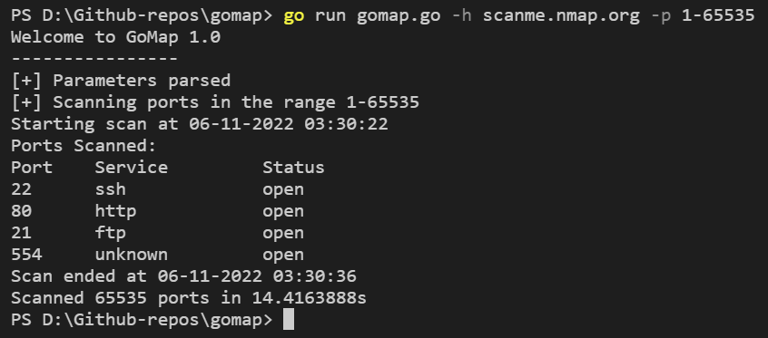

# gomap
Multithreaded nmap-like scanner in Go

## Description
A tool to simply check which ports are open in a host.

## Usage
Build the tool using `go build .`. A sample scan be run on `scanme.nmap.org` using the command `gomap -h scanme.nmap.org` which will scan the first 1000 ports.

## Flags
- -h
Specify the host to scan.
- -p
Give a range of ports to scan or specific ports separated by commas like `-p 21,22,80`. Default is the first 1000 ports. 
- -t
Specify timeout(in seconds) to wait for response from each port. Default is 2 seconds.

## Example

## Still working on..
- [x] Giving documentation to functions and packages.
- [ ] Adding service names of more ports.
- [ ] Saving the results to a file.
- [x] Issues with appending open ports to slice in a locked area (thread-safe).
- [ ] Separate service/port mappings from the code.
- [ ] Detect if packets are filtered on a port.
- [ ] Using better system of classifying ports during scan than appending to new slice.